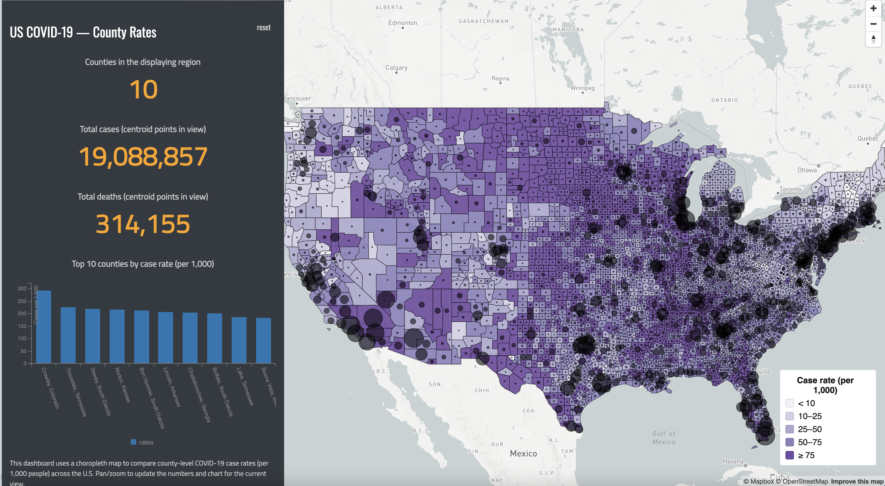

# US COVID-19 Smart Dashboard

**Webmap URL:**  
https://TTsui123.github.io/ttsui123.covidus/

## Geographic phenomenon

This dashboard visualizes the geographic distribution of COVID-19 impacts across U.S. counties in 2020. It uses two datasets, a county polygon GeoJSON with COVID-19 case rates and a county centroid GeoJSON with case and death counts.
(From previous lab)

## Why a choropleth map?

I chose a choropleth map because the main dataset is county polygon geometry and the key variable is a standardized rate of COVID-19 cases. Choropleths are well suited for comparing normalized values across geographic areas rather than raw totals, which helps highlight relative differences in severity across counties. 

## Datasets (Internet / local sources)

This project uses:

- **County polygon GeoJSON** (`assets/us-covid-2020-rates.geojson`) — contains COVID case counts, death counts, population, and per-capita rates.
- **County centroid GeoJSON** (`assets/us-covid-2020-counts.geojson`) — contains point representations of counties with cases and deaths.

These allow the dashboard to show both geographic variation (choropleth) and point data summaries.

## Dashboard components

This dashboard includes:

1. **Choropleth map** of case rates (cases per 1,000 people) across U.S. counties.
2. **Point overlay** sized by case counts from a second dataset.
3. **Dynamic sidebar numbers**:
   - Counties currently in view
   - Total cases (points in view)
   - Total deaths (points in view)
4. **Dynamic chart (C3.js)** showing the top 10 counties by COVID case rate within the current map view.
5. **Interactive reset** button to return to the default national view.

The map updates all numbers and the chart when the map moves (pan/zoom).

